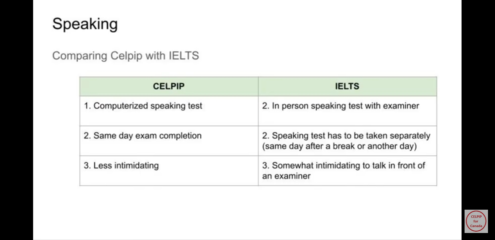
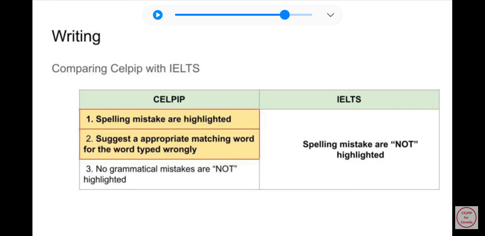

🚨Disclaimer: The document is based on the author\'s personal experience
and of those he has interacted with. This document/blog is NOT to be
construed as advice or consultation for the PR process

Pre-Application Process
-----------------------

### 1. Educational Credential Assessment

You need to get your **foreign** (not Canadian) educational credential
assessed by one of IRCC\'s [[approved third
parties]{.underline}](https://www.canada.ca/en/immigration-refugees-citizenship/services/immigrate-canada/express-entry/documents/education-assessed/how.html).
The assessment is valid for 5 years. Most used options are:

1.  [[WES]{.underline}](https://www.wes.org/ca/) - ECA Application for
    > IRCC

```{=html}
<!-- -->
```
2.  IQAS

**It can take up to 2-3 months to get this done from scratch.**

### 2. NOC

This is needed to understand what your work experience is worth as
points are awarded for different types of Skills / TEER. You can check
your NOC code [[here]{.underline}](https://noc.esdc.gc.ca/).

💡New 2016 vs 2021 mapping is
[**[here]{.underline}**](https://www.statcan.gc.ca/en/statistical-programs/document/noc2016v1_3-noc2021v1_0#wb-auto-2)

### 3. Language test 

*Covers English Only*

  Program   NOC           Canadian Language Benchmarks
  --------- ------------- ------------------------------
  **FSW**   **All**       **CLB 7**
  **CEC**   **NOC O/A**   **CLB 7**
  CEC       NOC B         CLB 5

We usually have profiles which are NOC A / TEER 1. There are [[two
exams]{.underline}](https://www.canada.ca/en/immigration-refugees-citizenship/services/immigrate-canada/express-entry/documents/language-requirements/language-testing.html)
for English -

1.  [[IELTS]{.underline}](http://www.ielts.org/) - General Training

    -   IELTS Youtube channel -
        > [[https://youtu.be/Zx-JcXsbUqQ]{.underline}](https://youtu.be/Zx-JcXsbUqQ)

    -   E2Learning Youtube channel -
        > [[https://youtube.com/c/E2IELTS]{.underline}](https://youtube.com/c/E2IELTS)

```{=html}
<!-- -->
```
2.  [[CELPIP-G]{.underline}](http://www.celpip.ca/) - CELPIP-General
    > test *(slightly easier than IELTS*)

    -   [[CELPIP Official]{.underline}](https://youtu.be/UWvjZAFtIks)

    -   [[Mad English -Youtube
        > channel]{.underline}](https://youtube.com/c/MadEnglishTV)

    -   [[Other CELPIP
        > material]{.underline}](https://drive.google.com/drive/folders/1f44ucqKPwLPNqNKM1ssMCOB1Kee8DBhX)

Below are some of the key differences between IELTS and CELPIP

{width="6.267716535433071in"
height="3.0555555555555554in"}

{width="6.267716535433071in"
height="3.0555555555555554in"}

{width="6.267716535433071in"
height="3.0555555555555554in"}

{width="6.267716535433071in"
height="3.0555555555555554in"}

Express Entry (EE) Profile
--------------------------

There are three things we need before we can even create our EE profile
(see [[Pre-Application process]{.underline}](#pre-application-process))

1.  ECA

```{=html}
<!-- -->
```
2.  Language Test

```{=html}
<!-- -->
```
3.  NOC Code

You then create your EE profile by [[creating /
signing-in]{.underline}](https://www.canada.ca/en/immigration-refugees-citizenship/services/application/account.html)
your account with IRCC.

### 1. Start an application 

{width="2.2041666666666666in" height="1.25625in"}

After you sign in, you can start an application

### 2. Check Eligibility 

**Unless you already have a personal code, click on the relevant option
in the do not have a personal code section**

{width="2.1354166666666665in"
height="1.3104166666666666in"}

Most questions in this are pretty straightforward and you can keep
entering the details.

### 3. Comprehensive Ranking System (CRS) Score 

CRS Score is the basis for us receiving Invite-to-Apply (ITA). You can
use the
[[tool]{.underline}](https://www.cic.gc.ca/english/immigrate/skilled/crs-tool.asp)
that is on IRCC website to evaluate your score even before you create
your EE profile.

The scoring is divided into sections of factors. You can experiment with
the tool to see how you can maximize your CRS Score.

Here are some areas where one can maximize points for CRS Score.

-   **Education** - Maximize credentials up to Masters / Double
    > Bachelors. This includes additional points for spouse as well.

```{=html}
<!-- -->
```
-   **Language Results** - Maximize scores CLB 9+ is what gets you max
    > scores. This includes additional points for spouse as well.

```{=html}
<!-- -->
```
-   **International (non-Canadian) Work Experience** - In case you have
    > been with Cognizant for less than 3 years outside of Canada, reach
    > out to previous employers for Work Experience letters.

Here's an
[[article]{.underline}](https://moving2canada.com/comprehensive-ranking-system-express-entry/)
which explains the factors better.

*Article may be a bit dated, but close to current state*

**Other links**

-   [[Recent PR Draw
    > Results]{.underline}](https://www.canada.ca/en/immigration-refugees-citizenship/services/immigrate-canada/express-entry/submit-profile/rounds-invitations.html)

-   [[Points Ranking
    > Criteria]{.underline}](https://www.canada.ca/en/immigration-refugees-citizenship/services/immigrate-canada/express-entry/eligibility/criteria-comprehensive-ranking-system/grid.html)

### 4. Submitting EE Profile 

💡*At the stage of creating the EE Profile, you will only be asked for
adult co-applicants i.e., spouse and children over age of 18. Details
for children under 18 need to be filled only once you receive the ITA*

The Profile has a section for each adult candidate [only]{.underline}.

*AN: If anyone has a better explanation for it, please share it and I
will update*

#### Personal Details 

Personal details of the candidate.

#### Contact Details

Only Email now. more details are needed later

#### Education History 

This is the section your ECA credentials come in handy alongside your
Language test results.

💡Even if you have not gotten evaluation done for a particular degree,
you can enter the data and simply select ECA was not done.

#### Work History 

This section has your work history. Ideally, this should be work history
associated with your NOC.

An often-asked question - when does an applicant become qualified for
their NOC?

-   In some cases, it is the passing of a degree/masters.

```{=html}
<!-- -->
```
-   In others, it is the date when you first started in that role your
    > NOC describes

💡To maximize points and minimize paperwork, here's the thumb of rule on
how much history should be shared

1.  Max 3+ years of **non-Canadian experience**

2.  Minimum 1+ years of **Canadian experience**

*There will be a personal history section once you get ITA where will
have to fill in data for the last 10 years of your life, including being
employed, unemployed, student etc.*

#### Use of Representative

Only needed if you are using a consultancy or immigration lawyers.

💡Based on your score across sections IRCC will determine and qualify you
for all eligible streams

{width="3.3333333333333335in" height="1.875in"}

Fill ITA and Document Checklist
-------------------------------

### 1. Key Documents needed for ITA completion

🚨A lot of these documents are multiple files but you can upload only one
file. You will need to merge these files into a single document

-   #### PCC

> Multi-city does not matter for PCC\....PCC is asked for country of
> citizenship and any other country where you spent more than 6 months
> at a stretch

##### 

-   ##### [[India PCC]{.underline}](https://www.blsindia-canada.com/pol_clr_cert.php) 

-   ##### [[Canada RMCP - Criminal Record Check]{.underline}](https://www.rcmp-grc.gc.ca/en/criminal-record-checks) 

> 💡IRCC asks for it sometimes post-ITA

-   ##### [[US PCC]{.underline}](https://www.fbi.gov/services/cjis/identity-history-summary-checks) 

    -   [[Guide]{.underline}](https://docs.google.com/document/d/1ZT8_RTMR_C_1BoM2EJBE9bm7kx_zCWaFSyMp8DMhduU/edit)

-   ##### Police verification - fingerprints US and CAD

    -   [[FIPS - Toronto & Brampton]{.underline}](https://www.fips.ca)

    -   [[F1 - 8 locations in
        > GTA]{.underline}](https://www.f1fingerprint.ca/burlington?gclid=EAIaIQobChMI6MTBzZig9QIVIm1vBB1gZwz4EAAYASAAEg)

```{=html}
<!-- -->
```
-   #### Medicals

> This needs to be done by all family members(spouse and children),
> including those not traveling

-   ##### [[Link to nearest IME Panel Physician]{.underline}](https://secure.cic.gc.ca/pp-md/pp-list.aspx) 

-   ##### [[IME Exemption for in-land candidates till Oct 2024]{.underline}](https://www.canada.ca/en/immigration-refugees-citizenship/news/notices/2022-foreign-exempt-ime.html) 

-   ##### If you moved to Canada from US and did not give Canadian IME previously, you are not exempt from medicals 

```{=html}
<!-- -->
```
-   #### Digital Photograph ([[Specifications]{.underline}](https://www.canada.ca/en/immigration-refugees-citizenship/services/new-immigrants/pr-card/apply-renew-replace/photo.html))

    -   Details of when and where you got your photo taken are to be
        > added in letter of explanation

-   {width="5.567708880139983in"
    > height="7.370135608048994in"}

```{=html}
<!-- -->
```
-   #### Employment related proofs

    -   ##### Experience Letter ([[sample]{.underline}](https://drive.google.com/file/d/1a4B_XJ-F_tUt_Jt29fONyDGw0tJcQjSN/view?usp=drivesdk))

> 💡*People here suggest that we use PR-All Geography Letter instead of
> PR Canada Experience Letter as that provides more flexibility*

-   ##### PR - Job Offer Letter

-   ##### Payslips associated with each role 

-   ##### Promotion letters where available 

```{=html}
<!-- -->
```
-   #### Passport Details

    -   Author provided single merged document including older passport
        > with all pages where stamping was done

```{=html}
<!-- -->
```
-   #### For Spouse/Primary candidate 

    -   ##### Marriage certificate

    -   ##### Proof of change of last name, if changed post marriage

###### 💡In absence of any proof, one can you use a [[notarized affidavit / declaration of oath]{.underline}](https://docs.google.com/file/d/113OJAA8ZZ7tleNfFaTR0y2upUvcD3VWg/edit?usp=docslist_api&filetype=msword) in lieu of such proof

-   #### For child(ren)

    -   ##### Birth Certificate

    -   ##### Adoption documents (if child is adopted)

```{=html}
<!-- -->
```
-   #### Proof of Funds

    -   ##### [[Exemption for PoF for CEC Category]{.underline}](https://www.canada.ca/en/immigration-refugees-citizenship/services/immigrate-canada/express-entry/documents/proof-funds.html) 

```{=html}
<!-- -->
```
-   #### Study and language related proofs

    -   ##### Marksheets

    -   ##### Convocation/ Degree certificate

    -   ##### WES accreditation

    -   ##### IELTS/ CELPIP score

-   #### Letter of Explanation 

    -   Needed for all applicants including children separately

    -   ##### [[Template for use]{.underline}](https://docs.google.com/document/d/1h3C1hJqeAt3ixfg3Fjn8FO8QMPlxl2zL/edit?usp=drivesdk&ouid=103712271468386536015&rtpof=true&sd=true)

### 2. Filling the form

-   #### Personal Details

    -   ##### Family Section

> At the end there is a section for list of family members who are not
> moving to Canada. For each adult candidate, it should include parents
> and siblings. For children, it would normally be blank since their
> family i.e. parents and siblings are moving with them
>
> 🚨*Something specific to candidates who\'ve spent time in US is needed
> but Author has no idea about this*

-   #### Contact Details

    -   You are asked for your phone number and you can give multiple

    -   Address history needed here for past 10 years, ***but no
        > documented proof is needed for this***

-   #### Study and languages

    -   In addition to details in EE profile, mother tongue/ native
        > language of candidate is asked for.

-   #### Work History (FAQs)

##### Q. When did you become eligible for NOC code you are applying under ?

> *A. Depends on case to case basis. It can be when you qualified to be
> an engineer (bachelors/masters) or when you started working in streams
> associated with your NOC*

##### Q. Was a positive LMIA issued for current work permit?

> *A . No My work permit is exempt from an LMIA for **other reasons and
> is employer-specific***

##### Q. What address should I use for contact address of current employer?

> *A. Address mentioned in Job Offer letter ( depends if you\'re in GTA
> or Halifax)*

-   #### Personal History

    -   Employment, education history, including gaps to be called out
        > as unemployed

    -   Travel history to include information on entry and exit into
        > each country apart from country of current residence (i.e.
        > Canada) and Country of Citizenship (i.e. India)

> 🚨This is used to determine countries for PCC
